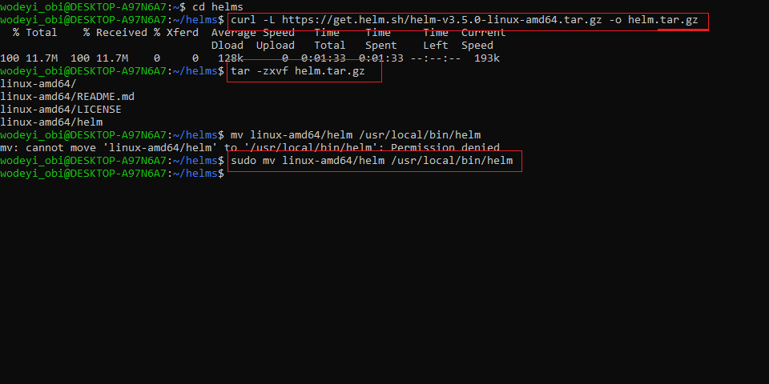
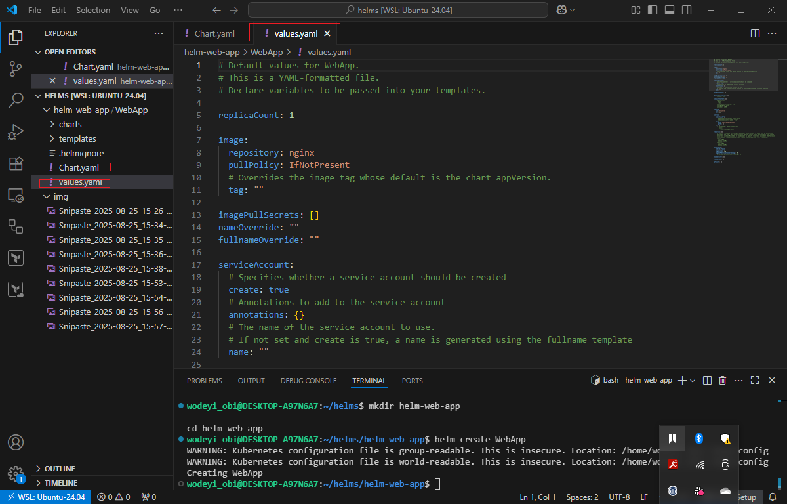

# 🚀 Deploying a Web Application Using Helm in Kubernetes

## 📖 Overview
In this project, we will deploy a **simple web application** into a Kubernetes cluster using **Helm**.  

The project covers:  
- 📦 Using **Helm Charts** to package Kubernetes applications  
- 🛠️ Customizing deployments with **templates** and **values**  
- ⚙️ Installing and running **Helm**  
- 🔄 Integrating Helm into a **basic CI/CD pipeline** for automated deployments  

By the end, you’ll understand how Helm simplifies application management in Kubernetes and how it fits into a DevOps workflow.

---

## 🎯 Objectives
1. Learn the fundamentals of Helm (charts, values, releases, repositories).  
2. Deploy a web application into Kubernetes using Helm.  
3. Customize configurations using `values.yaml`.  
4. Perform upgrades and rollbacks with Helm.  
5. Integrate Helm into a CI/CD pipeline for automated deployments.  

---

## 🏗️ Project Architecture


Developer → Git Repository → CI/CD Pipeline → Kubernetes Cluster
│
└── Uses Helm for deployment


- **Developer** pushes code changes.  
- **CI/CD Pipeline** builds and packages the application.  
- **Helm** deploys or updates the release in Kubernetes.  

---

## ⚙️ Prerequisites
- A running **Kubernetes cluster** (Minikube, Kind, or Cloud-managed like EKS/GKE/AKS).  
- **kubectl** installed and configured.  
- **Helm 3** installed.  
- Docker (for building application image).  
- A GitHub or GitLab account (if integrating with CI/CD).  

---

## 🔧 Setup & Installation

### 1. Install Helm
```bash
curl https://raw.githubusercontent.com/helm/helm/main/scripts/get-helm-3 | bash
helm version
```








